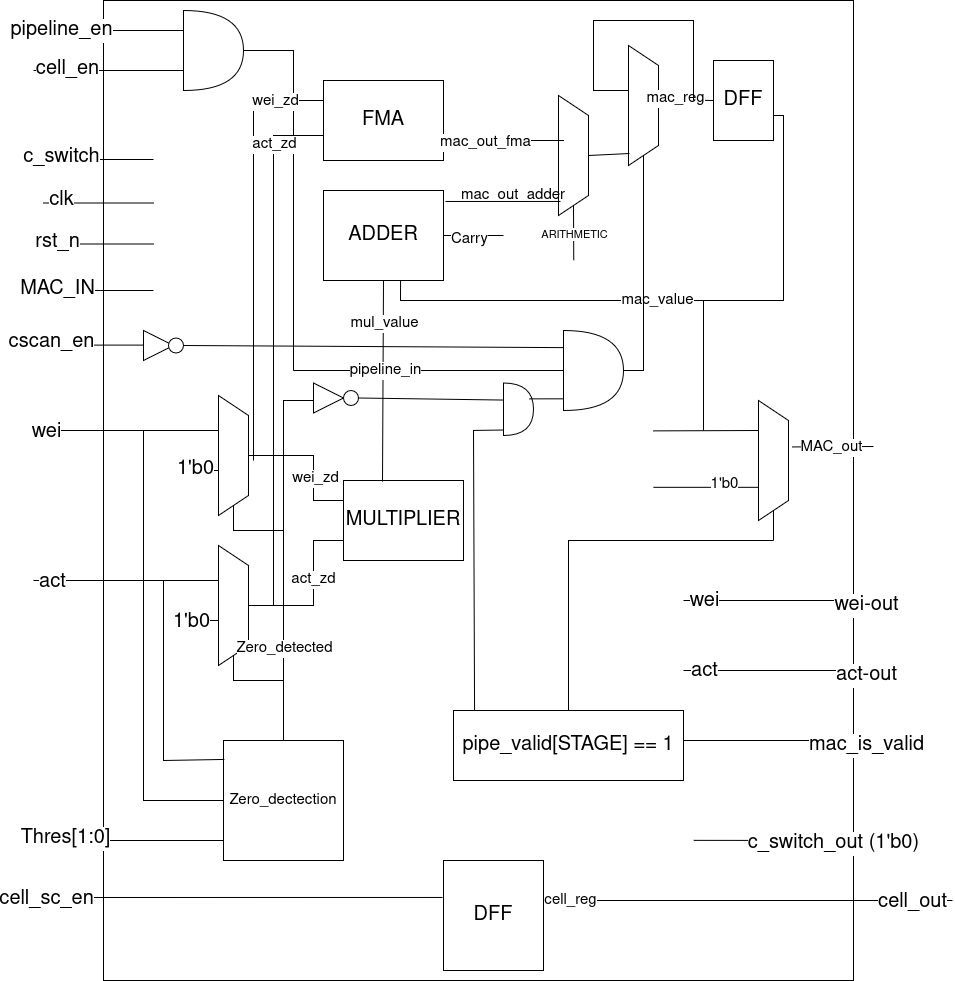
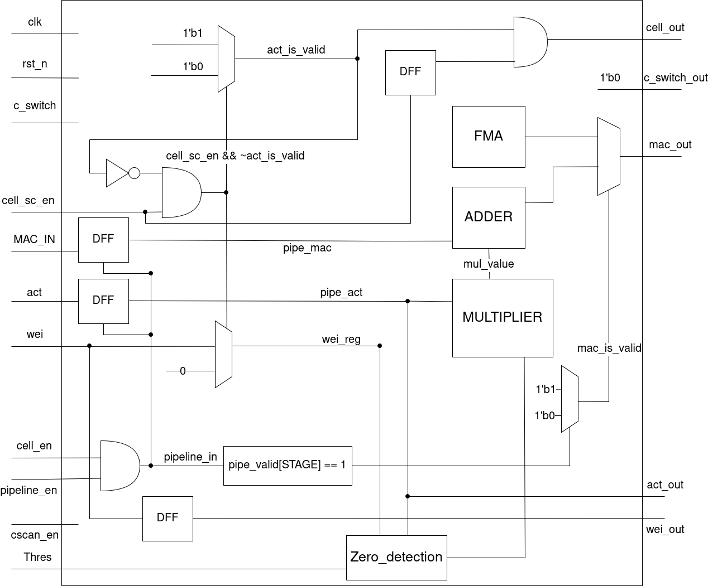

# SAURIA_CORE
RTL code of SAURIA Core and testbench to test each module

## 1. ADDER
###   a. Adder Gear (Generic Error-tolerant Adder):
      -Divide into many Sub-Adder then add them together to create the Result.
      -Low blocks: no carry propagation.
      -High blocks: exact addition.
      -The partial results are combined to create final sum.
###   b. Adder Gear 2c:
      -Gear Adder version used for signed two’s complement numbers.
###   c. Adder Ideal:
      -Ideal adder, using standard Adding Operands (+) to compare.
###   d. Adder Loa (Lower Part OR Adder):
      -Adder is split into low and high bit.
      -Only using Add function for high bit, using OR function for low bit.
###   e. Adder Trua (Truncated Adder):
      -Ignore carry from low bits, only add number from high bits.
###   f. Adder Truah (Truncated Adder – High Accuracy):
      -Carry from low bits is estimated, guess the carry.
###   g. Adder Generic:
      -Control different adders by using ADD_TYPE to compare the result of different adders.
      
## 2. MULTIPLIER
###   a. Bam_cell (Bit-level AND Multiplier):
      -And bit then sum with the previous result and carry.
###   b. Multiplier Bam_cell:
      -Constructed by using multiple Bam_cell units.
      -Generate partial products using AND operations and accumulates them using carry.
###   c. Multiplier 2x2:
      -A small-scale multiplier which multiplies 2-bit operands.
      -Using bacic AND gates and adders to generate 4-bit output
###   d. Multiplier Ideal
      -An ideal multiplier created by directly using /*/ operator.
      -Used as a golden model to compare and verify other multipliers.
###   e. Multiplier Booth
      -Implements the Booth Multiplication Algorithm.
      -Reduces the number of partial products by encoding the multiplier.
###   f. Wallace 4-bit
      -A 4-bit multiplier using Wallace Tree structure.
      -Using 4 multiplier 2-bit to calculate the result.
###   g. Wallace 8-bit
      -An 8-bit extension of Wallace 4-bit.
      -Using Wallace 4-bit for calculating instead of Multiplier 2x2
###   h. Wallace 16-bit
      -A 16-bit extendsion of Wallace 8-bit
###   g. Multiplier Wallace
      -A general Wallace tree multiplier.
      
## 3. PE
###   Verification Plan for PE
[https://mphcmiuedu-my.sharepoint.com/:x:/g/personal/ititiu22079_student_hcmiu_edu_vn/IQC0wkPXaIB7Tq4I-hlCgAkPAVLJUxNocYbcnPVQndi1700?e=vnJbsw](https://mphcmiuedu-my.sharepoint.com/:x:/g/personal/ititiu22079_student_hcmiu_edu_vn/IQC0wkPXaIB7Tq4I-hlCgAkPAfDabHpD3DtsSQVKKEnfaag?e=iWINSQ)

###   a. Output-Stationary Processing Element Block Diagram (PE_OS)

  

- An Output-Stationary Processing Element designed for MAC operations.
- Each PE contains a local accumulator to store partial sums.
- The partial sum (output) remains stationary inside the PE during computation.
- Input activation and weight are multiplied and accumulated locally.
- The final output is written out only after the accumulation is complete.

###   b. Input-Stationary Processing Element Block Diagram (PE_IS)

  

- An Input-Stationary Processing Element designed for MAC operations.
- Each PE contains a local activation register that keeps the input activation stationary during computation.
- Input activations remain inside the PE, while weights stream through the array.
- Incoming weights are multiplied with the locally stored activation.
- The multiplication results are accumulated with incoming partial sums.
- Partial sums propagate through the array until the final result is produced.

###   c. Weight-Stationary Processing Element Block Diagram (PE_WS)

  

- An Output-Stationary Processing Element designed for MAC operations.
- Each PE contains a local weight register that keeps the weight stationary during computation.
- Weights remain inside the PE, while input activations stream through the array.
- Incoming activations are multiplied with the locally stored weight.
- The multiplication results are accumulated into a local accumulator.
- The final output is written out after all activations have been processed.

## 4. SYSTOLIC ARRAY
